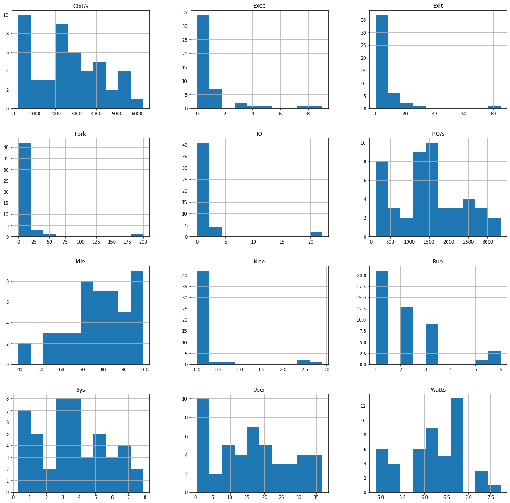

# ml-power-saver
ML based dynamic power saver application
```python
import pandas as pd
import matplotlib.pyplot as plt
import seaborn as sns
```


```python
data = pd.read_csv('Power.csv')
```


```python
data.head()
```


<div>
<table border="1" class="dataframe">
  <thead>
    <tr style="text-align: right;">
      <th></th>
      <th>Time</th>
      <th>User</th>
      <th>Nice</th>
      <th>Sys</th>
      <th>Idle</th>
      <th>IO</th>
      <th>Run</th>
      <th>Ctxt/s</th>
      <th>IRQ/s</th>
      <th>Fork</th>
      <th>Exec</th>
      <th>Exit</th>
      <th>Watts</th>
    </tr>
  </thead>
  <tbody>
    <tr>
      <td>0</td>
      <td>10:06:20</td>
      <td>2.4</td>
      <td>2.4</td>
      <td>1.9</td>
      <td>92.5</td>
      <td>0.9</td>
      <td>1</td>
      <td>576</td>
      <td>538</td>
      <td>8</td>
      <td>9</td>
      <td>9</td>
      <td>5.76</td>
    </tr>
    <tr>
      <td>1</td>
      <td>10:06:30</td>
      <td>0.6</td>
      <td>0.0</td>
      <td>0.4</td>
      <td>97.7</td>
      <td>1.3</td>
      <td>1</td>
      <td>247</td>
      <td>172</td>
      <td>2</td>
      <td>0</td>
      <td>6</td>
      <td>5.37</td>
    </tr>
    <tr>
      <td>2</td>
      <td>10:06:40</td>
      <td>0.4</td>
      <td>0.0</td>
      <td>0.3</td>
      <td>99.3</td>
      <td>0.0</td>
      <td>1</td>
      <td>169</td>
      <td>124</td>
      <td>1</td>
      <td>0</td>
      <td>1</td>
      <td>5.01</td>
    </tr>
    <tr>
      <td>3</td>
      <td>10:06:50</td>
      <td>3.2</td>
      <td>0.0</td>
      <td>1.1</td>
      <td>95.2</td>
      <td>0.4</td>
      <td>2</td>
      <td>777</td>
      <td>606</td>
      <td>0</td>
      <td>0</td>
      <td>1</td>
      <td>4.95</td>
    </tr>
    <tr>
      <td>4</td>
      <td>10:07:00</td>
      <td>7.5</td>
      <td>0.0</td>
      <td>2.5</td>
      <td>87.8</td>
      <td>2.2</td>
      <td>3</td>
      <td>1437</td>
      <td>1099</td>
      <td>10</td>
      <td>3</td>
      <td>5</td>
      <td>5.20</td>
    </tr>
  </tbody>
</table>
</div>


```python
data.hist(figsize = (20, 20))
plt.show()
```





```python
cor = data.corr()
plt.figure(figsize= (12, 9))
sns.heatmap(cor, vmax=0.8, square=True)
plt.show()

```


```python

```
